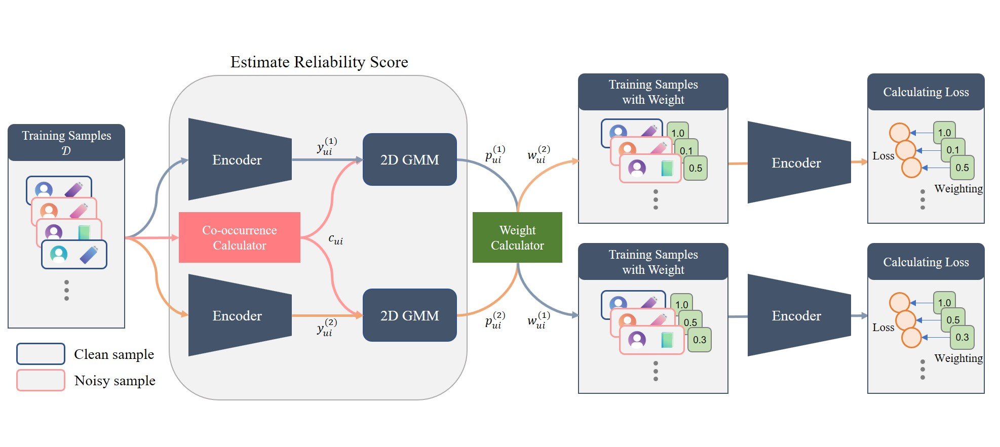

# Joint Modeling of Prediction and Behavioral Patterns for Reliable Recommendation with Implicit Feedback

This repo provides the official PyTorch implementation of our JMPBP accepted by [IEEE Access](https://ieeexplore.ieee.org/document/10930460) 2025.

> Abstract: Implicit feedback in recommender systems contains noisy interactions that do not reflect true user preferences, which diminishes the accuracy of recommendations. Current methods identify unreliable interactions using single indicators like loss values or model disagreement but fail to capture the complex patterns that separate genuine preferences from noise. This paper presents a method that estimates interaction reliability by analyzing two key signals: the prediction confidence of the recommender model and the consistency of user behavior across interaction sequences. Our approach uses a two-component two-dimensional Gaussian mixture model to estimate reliability by combining prediction scores with co-occurrence patterns that measure behavioral consistency. Instead of making binary decisions, we implement an adaptive weighting mechanism that allows interactions to influence training according to their estimated reliability. Evaluation on three public datasets (Yelp, Amazon-book and ML-1M) across three recommendation architectures shows that our method improves recommendation accuracy by up to 38\% compared to standard training and 33\% over existing denoising approaches. These improvements persist across different models and evaluation metrics, demonstrating the effectiveness of our reliability estimation approach. Our implementation is available at https://github.com/meruemon/JMPBP.

If you found this code helps your work, do not hesitate to cite my paper or start this repo.

## Overview of the Proposed



## Initial Setup and Usage Instructions

When using this repository for the first time, please follow the steps in "1. Initial Setup". For subsequent uses, start from "2. Container Launch".

## 1. Initial Setup

Below is an example of copying to the ~/Programs/ directory. Please modify as needed for your environment.

```bash
$ cd ~/Programs/JMPBP/docker
$ docker build -t jmpbp ./
```

Please modify the USER and UID in the Dockerfile to match your environment.

## 2. Container Launch

```bash
$ docker-compose up -d
$ docker exec -it jmpbp bash
$ cd code
```

## 3. Running the Model

### To reproduce the proposed method experiments:

The following command will run all combinations of datasets (Yelp, Amazon-book, ML-1M) and encoders (MFBPR, LightGCN, SGL) as described in proposed.sh:

```bash
$ bash shell/proposed.sh
```

For other comparison methods, values from the [DDRM](https://arxiv.org/abs/2401.06982) paper are used.

---

### For ablation studies:

To change the metrics, modify the '--gmm_input' parameter:
- Prediction score: `--gmm_input "score"`
- Co-occurrence frequency score: `--gmm_input "cui"`
- Both metrics: `--gmm_input "score cui"`

---

### For hyperparameter analysis:

| Parameter | Description |
| --------- | ----------- |
| `--warmup` | Parameter to specify the number of warm-up epochs |
| `--alpha` | Parameter to adjust the scaling coefficient |

The hyperparameters for the proposed method in the paper are as follows:

| Model    | Yelp                       | Amazon-book                | ML-1M                     |
|----------|----------------------------|----------------------------|---------------------------|
| MF-BPR   | --warmup=10, --alpha=0.25  | --warmup=10, --alpha=0.25  | --warmup=5, --alpha=1.0   |
| LightGCN | --warmup=10, --alpha=0.125 | --warmup=10, --alpha=0.125 | --warmup=30, --alpha=0.25 |
| SGL      | --warmup=5, --alpha=0.5    | --warmup=5, --alpha=0.125  | --warmup=30, --alpha=0.5  |

---

### Other major parameters:

| Parameter | Description |
| --------- | ----------- |
| `--thres` | Parameter to adjust the threshold in weight scaling |
| `--ensemble_prediction` | Whether to use two networks for prediction (1: use, 0: don't use) |
| `--early_stop` | Whether to perform early stopping based on validation data (1: use, 0: don't use) |
| `--noisy_rate` | Parameter to specify random noise (set to 0 for DDRM datasets as they already contain low-evaluation noise) |
| `--full_log` | Parameter to save weights needed for visualization (set to 0 to check performance only, as file size becomes large) |
| `--pth, --pth2` | Parameters to specify the weights of two trained networks for inference using pre-trained models |

### Citation
If you find this code helps your work, please cite our paper:
```
@Article{sugiyama_2025_jmpbp,
    AUTHOR = {Sugiyama, Takuto and Yoshida, Soh and Muneyasu, Mitsuji},
    TITLE = {Joint Modeling of Prediction and Behavioral Patterns for Reliable Recommendation with Implicit Feedback},
    JOURNAL = {IEEE Access},
    VOLUME = {------------vol------------},
    YEAR = {2025},
    NUMBER = {------------num------------},
    ARTICLE-NUMBER = {------------art------------},
}
```
